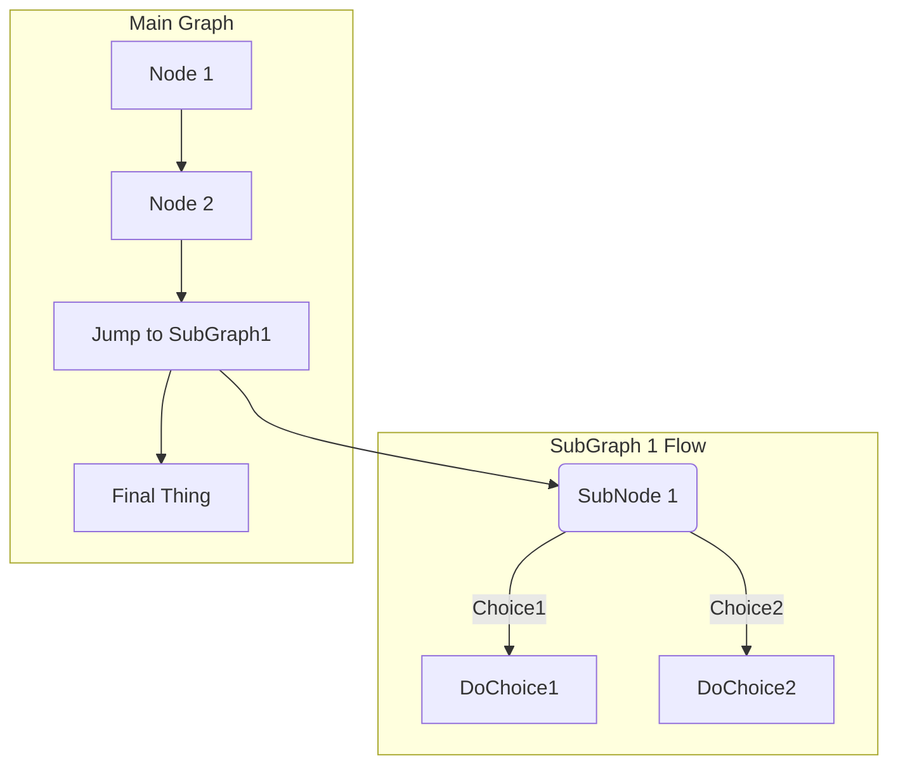

# WHY
It's made as my University project. The request was to made own db with bunch of scripts.

If you look for some good examples of TSQL and SQL for Microsoft SQL server you are in the right place.

Using constraints, procedures, views and all of this in one place.

Hope this helps! 

And here is 

## ToDo
```
- napisanie sprawozdania w jakimś Markdown lub Latex
- sprawdzenie tego markdown marmaid. Jak będzie lipne to PlantUML na pełnej.
- dodać 2 niebanalne widoki (oparte na kilku tabelach i ukrywające część danych dla użytkowników)
09/01/21#10:31:37 😀 	- dodać widok ostatniej pozycji samochodu dla danego kierowcy
	- podający wszystkie godziny pracy w tym miesiącu dla danego pracownika
	- dodać widok poprzedniego kierowcy, który używał danego samochodu
09/01/21#10:00:34 😀 - dodać procedurę dodającą przepracowane godziny dla pracownika
09/01/21#09:52:11 😀 - dodać procedurę do uaktualniania pozycji pojazdu jeżeli poprzednia jest 15 minut mniejsza od ostatniej aktualizacji
```

## Done
```
08/31/21#18:17:51 😀 - Dodać 5 historyjek użytkonika. Ma być 2 użytkowników.
	Jako ... chcę ...potrzeba użytkownika... żeby ...cel który chcę osiągnąć
08/31/21#18:20:03 😀 - dodać usuwanie bazy danych i jej tworzenie # nie potrzeba, będę leciał na master
08/31/21#18:36:51 😀 - dodać tworzenie jednej tabeli i jej usuwanie
08/31/21#19:08:31 😀 - dodać minimum 5 tabel wraz z ich usuwaniem
08/31/21#22:39:41 😀 - stworzyć procedurę do dodawania elementów do bazy danych
	 wypełnić bazę danych 3 rekordami
```

### User stories:
```
Topic:
System do zarządzania flotą samochodów ciężarowych

- Jako kierowca chcę mieć możliwość sprawdzenia gdzie ostatnio zaparkowałem pojazd żeby móc go odnależć.
- Jako szef chcę wiedzieć ile samochodów jest obecnie gotowych do pracy tak abym mógł lepiej zaplanować koszty amortyzacji.
- Jako pracownik biura chciałbym mieć możliwość monitorowania czy pracownik oddał samochód na czas tak abym mógł określić jego przyszłą przez liczbę przepracowanych godzin.
- Jako kierowca chcę wiedzieć kto przede mną używał pojazdu tak abym mógł zgłosić nieprawidłowości stanu.
- Jako zewnętrzna firma obsługująca monitorowanie pojazdów firmy chielibyśmy mieć możliwość zapisywania ostatniej pozycji pojazdu co 15 min tak aby w przyszłości łatwiej móc określić pozycję pojazdu po jego uruchomieniu.

This might sound silly but when I build any DB I don't start from ERD diagrams since it takes time to build them.
Istead I make this little description that later is directly made in SQL. It's much easier for me to work this way...
Sometimes I use PlantUML though.

Pracownik
	id
	imie
	nazwisko
	typ: TypPracownika
	liczbaWypracowanychGodzin
	stawkaGodzinowa

PracownikToGodziny
	id
	idPracownik
	idRozkladGodzin

RozkladGodzin
	id
	iloscGodzin
	dzienPracy

TypPracownika
	id
	typ: 'Szef, kierowca, biuro'

Magazyn
	id
	nazwa
	lat
	lon

MagazynPracownik
	id
	idMagazynu
	idPracownika

PojazdyWUżyciu
	id
	idPojazd
	idOstatniaPozycjaPojazdu


Pojazd
	id
	idPracownik
	marka
	uszkodzony
	ostatniaPozycjaId

OstatniaPozycjaPojazdu
	id
	lat
	lon
```

TEST mermaid

